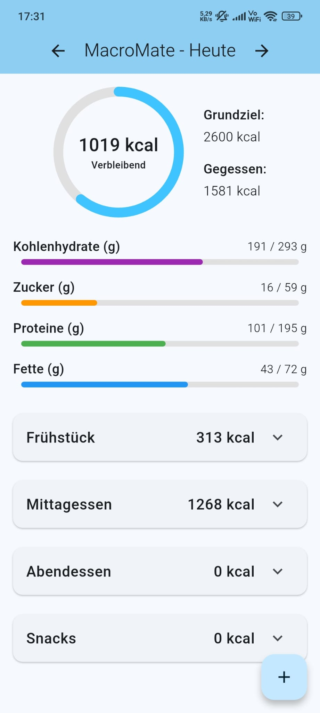
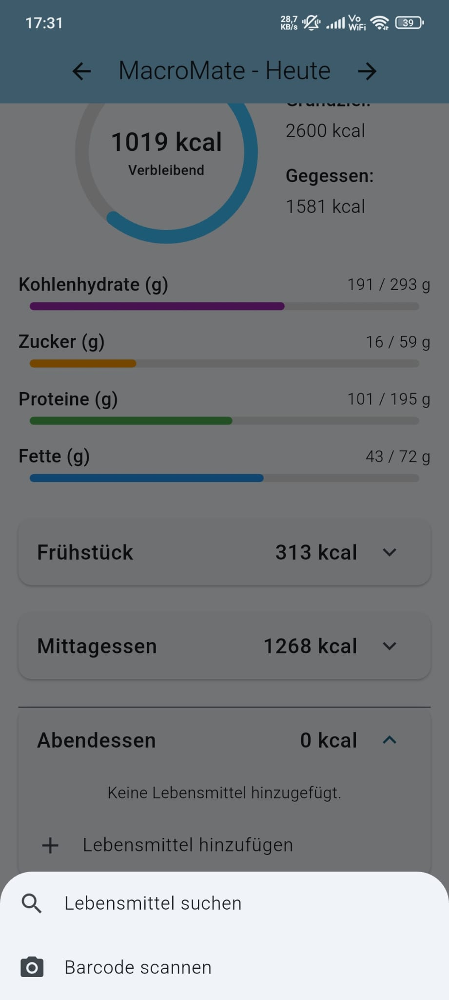
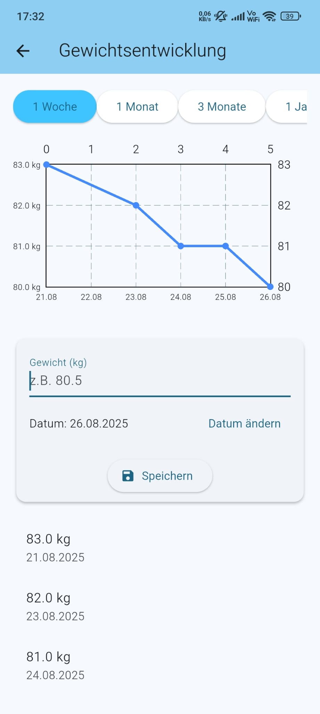
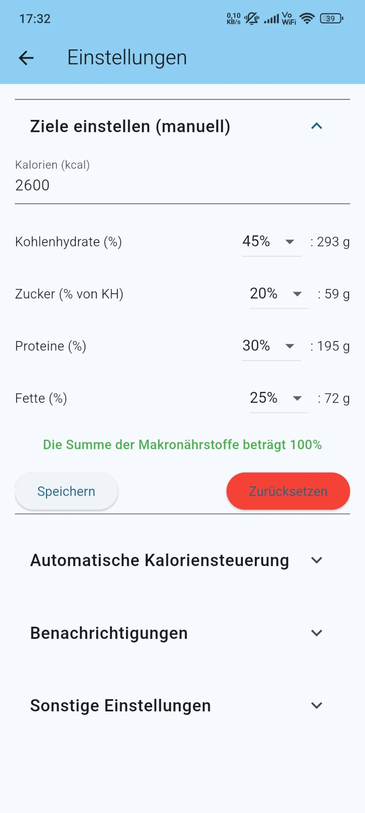

# MacroMate

<p align="center">
  <video src="docs/screenshots/output_blurred_cut.mp4" width="640" controls muted playsinline></video>
  <br/>
  <a href="docs/screenshots/output_blurred_cut.mp4">Video ansehen</a>
  
</p>

MacroMate ist eine Flutter-App zum Tracken von Kalorien und Makronährstoffen. Sie bietet Barcode-Scanning, Gewichtserfassung und Erinnerungen, damit du deine Ernährungsziele im Blick behältst.

## Features
- Tagesübersicht mit Ziel- und Ist-Werten für Kalorien, Kohlenhydrate, Proteine, Fette und Zucker
- Mahlzeiten verwalten (Frühstück, Mittagessen, Abendessen, Snacks)
- Lebensmittel per Barcode scannen (Open Food Facts Integration)
- Eigenes Lebensmittellager mit Import/Export als JSON
- Gewicht verfolgen und Auswertungen betrachten
- Lokale Push-Benachrichtigungen und Dark/Light-Mode

## Screenshots
<p align="center">
  
  
  
  
</p>

## Installation & Entwicklung
1. Flutter-SDK herunterladen (falls noch nicht vorhanden):
   ```bash
   ./scripts/setup_flutter.sh
   export PATH="$(pwd)/flutter_sdk/bin:$PATH"
   ```
2. Abhängigkeiten installieren:
   ```bash
   flutter pub get
   ```
3. App starten:
   ```bash
   flutter run
   ```

## Tests
Es sind derzeit keine automatisierten Tests vorhanden, der folgende Befehl bestätigt dies:
```bash
flutter test
```

## iOS-Build (kostenloses Provisioning)
1. Projekt bereinigen und Abhängigkeiten installieren:
   ```bash
   flutter clean
   flutter pub get
   cd ios && pod install && cd ..
   ```
2. Workspace in Xcode öffnen:
   ```bash
   open ios/Runner.xcworkspace
   ```
3. In Xcode unter **Signing & Capabilities** ein Team auswählen und auf einem Gerät mit \`⌘R\` starten. Das Zertifikat ist sieben Tage gültig.

## iOS-Build in GitHub Actions
Der Workflow `.github/workflows/build_ios_on_merge.yml` kann automatisch signieren. Notwendige Secrets:
- `APPLE_ID_EMAIL`
- `APPLE_ID_PASSWORD` (App-spezifisches Passwort)
Auf jedem Merge in `main` wird `flutter build ipa` ausgeführt und das Artefakt `Runner.ipa` bereitgestellt
